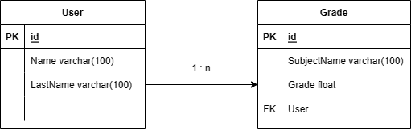

# Modul 151 LB2

### Kurzbeschreibung
Dieses Projekt ist eine API die mit PHP umgesetzt ist. Es können User erstellt und gelöscht werden. Für jeden User sind seine Schulnoten eingetragen. Diese kann ein User selbst eintragen. Das Projekt funktioniert ohne Login und ohne Sessions. 

### Architektur
Für dieses Projekt verwenden wir eine MVC Architektur. Da aber am Schluss kein Frontend exisitieren wird, werden also nur das Model und der Controller implementiert. 

### Thema 1: Native SQL Statements
#### Use Cases
1. User kann erstellt werden
2. User kann gelöscht werden
3. User können abgefragt werden
4. Note kann erstellt werden
5. Note kann gelöscht werden
6. Noten können abgefragt werden

|Endpoint| Use Case | Request Method |
|---|---|---|
| /user| Create User  |POST|
| /user | Get a User  |GET|
|/user/{userid} | Delete a User  |DELETE|
|/grade|Create Grade for User| POST |
|/grade|Get a Grade| GET|
|/grade/{gradeid}|Delete a Grade of a User|DELETE|

#### ERM

In der User Tabelle ist der Vor- und Nachname enthalten.
In der Grade Tabelle ist eine Note mit dem Fach und dem user enthalten.
1 User kann mehrere Grades haben.

### Reflektion